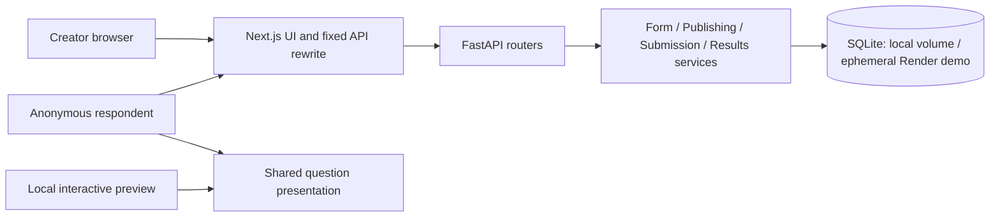
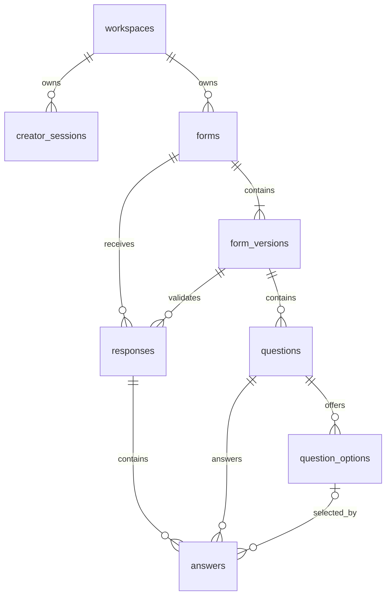

# Application architecture

Status: **Phase 2 core API, domain schema and seeds implemented and verified locally**. Frontend feature screens remain planned for Phases 3–6. The user reported Vercel/Render deployment and explicitly deferred missing Phase 1 live checks to continue Phase 2; no cloud durability is inferred. Read with [REQUIREMENTS.md](REQUIREMENTS.md), [DESIGN_REFERENCE.md](DESIGN_REFERENCE.md), and the phase gates in [IMPLEMENTATION_PLAN.md](IMPLEMENTATION_PLAN.md).

## Implemented foundation and version resolution

The current code contains health/readiness endpoints, runtime Alembic setup, origin checks, structured errors, a temporary cookie-scoped `foundation_probes` table/API, generated OpenAPI TypeScript types, and a responsive workspace shell with shared tokens/buttons/dialogs. The probe is explicitly enabled in examples and deployment configuration for verification, disabled by default, and must be disabled before final release. It is not creator authentication or seed form data.

Resolved versions include Next.js 16.4.0, React 19.3.0, TypeScript 5.9.3, Tailwind 4.3.3, FastAPI 0.143.0, SQLAlchemy 2.1.4, and Alembic 1.20.0. The selected version-2 SQLAlchemy family is retained. Exact direct frontend versions and all transitive/backend versions live in committed manifests and lockfiles. Node 24.15+ in the 24.x line and Python 3.11 are the tested runtime targets. TypeScript stays at 5.9.3 for compatibility with OpenAPI generation; current compiler 7.x was not selected. Dnd kit and Motion will be installed when their feature phases begin.

Native/browser testing and production Docker builds are separate evidence. Browser tests use a real standalone artifact and dedicated ports 13000/18080; a runner builds the correct rewrite first. Compose exposes only frontend port 3000 and reaches backend:8000 internally, avoiding a conflict with an existing unrelated local Docker service. Startup copies static assets for native standalone execution just as the container does.

The working GitHub repository is private by the user's instruction; public visibility remains a submission requirement. The user will take over Vercel deployment. On 2026-10-09 they selected Render Free + an external minutely ping, superseding the paid disk proposal. [DEPLOYMENT.md](DEPLOYMENT.md) specifies setup and the revised HTTPS cookie/reload/ping gate. Local success is not substituted for deployed evidence.

## Selected stack and tradeoffs

| Layer | Selection | Rationale and tradeoff |
|---|---|---|
| Frontend | Next.js 16 App Router, React, strict TypeScript | Meets required framework and provides understandable route/layout structure. Pin compatible versions instead of relying on floating latest versions. |
| Styling | Tailwind CSS with semantic CSS variables | Direct control over Typeform fidelity; central tokens prevent drift. Utility styling is not a substitute for a coherent design. |
| Accessible controls | Radix primitives | Dialog/menu/focus foundations without imposing a visual theme; test actual keyboard behavior after styling. |
| Reordering | Current `@dnd-kit/react` and compatible sortable helpers | Pointer and keyboard support; check current APIs, do not mix legacy `@dnd-kit/core` examples into the new package. |
| Motion | Motion for React | Directional transitions and reduced-motion support; protect navigation from animation races. |
| Server data | TanStack Query | Fetch state, invalidation, mutation lifecycle; local edits do not wait for server round trips. |
| Local state | Feature-local reducers and React context | Explicit builder and respondent state machines without an additional global store. |
| Backend | FastAPI, Pydantic 2, SQLAlchemy 2, Alembic | Typed contracts, OpenAPI, relational control, migrations. Synchronous database sessions and ordinary synchronous FastAPI endpoints keep SQLite behavior straightforward. |
| Database | SQLite, relational schema below | Assignment requirement; one instance and short transactions. Local volume is durable; the selected Render Free demo filesystem is ephemeral. |
| Tests | pytest/HTTPX; Vitest/Testing Library; Playwright | Real API/database tests, focused component tests, integrated browser workflows. |

FastAPI is preferred over Django because a custom frontend and focused API are central; Django's admin and account system would add little to this selected demo model. Do not introduce microservices, background queues, WebSockets, generic repository frameworks, event sourcing, or a charting library for simple summary bars.

Official implementation references: [Next.js installation](https://nextjs.org/docs/app/getting-started/installation), [FastAPI modular applications](https://fastapi.tiangolo.com/tutorial/bigger-applications/), [dnd kit React](https://dndkit.com/react/quickstart/), [Radix Dialog](https://www.radix-ui.com/primitives/docs/components/dialog), [Motion accessibility](https://motion.dev/docs/react-accessibility), [TanStack Query](https://tanstack.com/query/latest/docs/framework/react/overview), [SQLAlchemy SQLite dialect](https://docs.sqlalchemy.org/en/20/dialects/sqlite.html). Recheck relevant version-specific documentation when implementing.

## System boundaries



Python owns all business rules and persistence. Next.js serves the interface and proxies a fixed `/api/v1` destination; it does not become a second business API. Preview consumes a local draft snapshot and a nonpersisting completion callback. It must never invoke submission or attempt endpoints.

## Frontend routes and components

| Route | Responsibility |
|---|---|
| `/` | Initialize/resume the anonymous creator session and enter the workspace. |
| `/forms` | Owned form dashboard and management actions. |
| `/forms/[id]/build` | Builder, inline canvas, question navigation, settings, save state. |
| `/forms/[id]/preview` | Interactive draft preview; desktop/mobile viewport control; no response writes. |
| `/forms/[id]/share` | Publish state, stable public URL, copy/open controls, unpublish. |
| `/forms/[id]/results` | Responses and summary tabs; tab/version/selection encoded in URL state where useful. |
| `/forms/[id]/workflow` | Explicit branching placeholder until B04 passes. |
| `/forms/[id]/connect` | Explicit integrations placeholder. |
| `/to/[slug]` | Anonymous fullscreen public respondent; no creator bootstrap or navigation. |

Expected module boundaries (files are to be created in later phases):

```text
frontend/
  src/app/                         route pages and shared layouts
  src/features/dashboard/         forms list, actions, dialogs
  src/features/builder/           reducer, canvas, settings, save queue
  src/features/respondent/        runner, navigation, transitions, submission
  src/features/results/           table, detail panel, summary
  src/components/questions/       registry, shell, answer controls, formatters
  src/components/ui/              styled accessible primitives
  src/lib/api/                    generated types, typed fetch wrapper
  src/styles/                     semantic tokens and global styles
  tests/                          component and browser tests
backend/
  app/main.py                     app construction and router registration
  app/config.py                   validated environment settings
  app/api/                        routers and session dependencies
  app/schemas/                    Pydantic input/output contracts
  app/services/                   domain operations and validation
  app/db/                         models, sessions, configuration
  app/seed.py                      deterministic synthetic sample data
  migrations/                     Alembic revisions
  tests/                          API and database integration tests
```

The shared question registry supplies an answer control, creator settings editor, defaults, client validator, and answer formatter for each type. Share the question shell and answer controls between public forms and preview. Builder inline editing is a separate concern; avoid one component filled with creator/respondent conditionals.

Generate TypeScript API types from backend OpenAPI and use a small fetch wrapper for credentials, structured errors, and cancellation. Client validators stay explicit and use shared fixture cases with Python tests; generated types do not replace runtime validation. Query caches hold server snapshots; builder reducers hold unsaved edits. Invalidate dashboard/results data after successful relevant mutations.

## Backend services

| Boundary | Owns |
|---|---|
| Routers | HTTP parsing, creator dependency, ownership lookup, response serialization, status codes. |
| Form service | Creation, draft save, rename, duplication, deletion. |
| Publishing service | Strict publication validation, immutable snapshot creation, opening/closing publication periods. |
| Submission service | Version resolution, answer normalization/validation, idempotency, atomic response writes. |
| Results service | Paginated submissions, historical detail, SQL aggregates per version. |
| Database modules | Mapped models, connection pragmas, sessions, transactions, migrations. |
| Seed module | Validated original synthetic definitions/responses, idempotent per-workspace initialization. |

Use one transaction per domain mutation. Do not perform network calls while holding SQLite write transactions. Surface recoverable contention as a structured service error; never return success before commit.

### Implemented Phase 2 contract details

- `0002_form_domain` is a frozen migration, independent of future ORM changes. It upgrades the existing diagnostic database without deleting it and has a tested downgrade/re-upgrade. The eight domain tables match ORM metadata. Published rows are immutable through the services; direct database administrators can still modify the database.
- Request sessions explicitly start `BEGIN` for a consistent read snapshot and `BEGIN IMMEDIATE` for mutations, before inspecting ownership, revisions or publication. SQLite serializes writers. FastAPI's function-scoped dependency commits before sending a successful response, and exceptions roll back. See [FastAPI dependency scope](https://fastapi.tiangolo.com/tutorial/dependencies/dependencies-with-yield/). Commit/disk failures and simultaneous writers have dedicated tests. No network work is done inside transactions.
- Draft save, rename, duplicate and publish require a quoted integer `If-Match`, such as `"3"`. Missing header: 428 `revision_required`; malformed header: 422; stale revision: 412. Detail/create/save/rename/duplicate responses expose the revision as ETag. Only the last accepted save mutation ID is retained: identical immediate replay succeeds, differing payload conflicts, replay after newer edits must reconcile a 412. Form deletion returns a JSON `{status: "deleted"}` response.
- Bounds selected for the demo: form title 200 characters; prompt/description 2,000; option label 500; at most 100 questions and 100 options per question; 100 supplied answers; pagination 1–100, default 30. Empty drafts are permitted, but publication requires a nonblank title/prompt and valid choice counts. Keys are UUID strings. Unsupported types/settings/extra fields are rejected.
- Theme storage is bounded to Inter plus hex background/text/accent colors; ending storage has title/description. This is persistence groundwork, not an implemented theme/ending customization UI or bonus.
- Outer text whitespace is normalized; internal long-text newlines survive. Email uses a bounded practical syntax check: ASCII unquoted local parts and IDNA domains with at least two labels, maximum 254 characters/64-character local part. It does not check deliverability or support every RFC mailbox form. Client validation must match these choices when the runner is built.
- New workspaces seed 12 product-feedback and 8 event-registration responses plus one draft through the normal definition/publication/submission services, in the same transaction as the creator cookie record. Values are deterministic synthetic examples; identifiers are independent random UUIDs. Failure rolls everything back. An existing cookie resumes its workspace and never seeds again. Simultaneous bootstraps with an existing cookie return the same workspace. Independent requests without any cookie have no identity to correlate; Phase 3 must share one bootstrap promise to avoid duplicate first-visit initialization.
- Results use bounded cursor pages (descending timestamp/ID, or version number/ID) and SQL aggregates. The first three ordered answers are a list preview; individual detail includes all questions/skips. Seed counts explicitly cast boolean values to integers before summing. The response preview query per row is bounded by the page maximum; batch optimization is unnecessary for this demo.

Actual code is under `backend/app/api`, `backend/app/schemas`, `backend/app/services`, and `backend/migrations/versions/0002_form_domain.py`; frontend contracts/wrappers are under `frontend/src/lib/api`. Later frontend state, autosave scheduling, rendering and client validation remain planned below.

## Relational schema

Use UUID identifiers and UTC timestamps. `question_key` and `option_key` are stable logical identifiers across versions; each stored version has its own physical rows/IDs. A duplicate form receives fresh logical identifiers.

| Table | Columns and responsibilities |
|---|---|
| `workspaces` | `id` PK, `name`, nullable `seeded_at`, `created_at`. One creator demo workspace per session. |
| `creator_sessions` | `id` PK, unique `token_hash`, `workspace_id` FK, `expires_at`, `created_at`. Never store the raw opaque cookie token. |
| `forms` | `id` PK, `workspace_id` FK, `title`, nullable unique `public_slug`, `is_published`, `publication_epoch`, `draft_revision`, nullable `last_save_mutation_id`, timestamps. |
| `form_versions` | `id` PK, `form_id` FK, `version_number`, `source_draft_revision`, `title`, bounded `theme_settings`/`ending_settings` JSON, `publication_epoch`, nullable `published_at`. Version 0 is mutable draft; positive versions are immutable publications. |
| `questions` | `id` PK, `version_id` FK, `question_key`, `type`, `title`, `description`, `required`, `position`, nullable `rating_max`. |
| `question_options` | `id` PK, `question_id` FK, `option_key`, `label`, `position`. |
| `responses` | `id` PK, `form_id` FK, `version_id` FK, `submission_key`, `payload_hash`, `submitted_at`, `is_seed`. Completed submissions only in the baseline. |
| `answers` | `id` PK, `response_id`, `version_id`, `question_id`, nullable `text_value`, `integer_value`, `boolean_value`, `option_id`. Exactly one typed answer value; unanswered optional questions have no row. |



### Constraints and indexes

- Unique `(form_id, version_number)`; one version-zero draft per form through this constraint and creation service.
- Unique `(version_id, question_key)` and `(version_id, position)`; unique `(question_id, option_key)` and `(question_id, position)`.
- Unique `(response_id, question_id)` and `(form_id, submission_key)`.
- Composite foreign keys tie `(responses.version_id, responses.form_id)` to the corresponding version/form; `(answers.response_id, answers.version_id)` to the response/version; `(answers.question_id, answers.version_id)` to the question/version; `(answers.option_id, answers.question_id)` to the option/question. Add the matching unique parent keys required by SQLite.
- Check constraints for supported question types, booleans, nonnegative positions, positive publication versions versus draft zero, and rating maximum 1–10 when applicable. Use an exactly-one-non-null check for typed answer columns. Type-specific domain checks also run in the server validator.
- Index forms by `(workspace_id, updated_at)`; responses by `(form_id, submitted_at, id)` for stable pagination; responses by version; answers by question. Index other foreign-key columns used in joins/cascades.
- Form deletion removes its versions, responses, answers, and options transactionally. Draft child replacement never touches published children. Prove cascading/composite relationships with real migration tests.

Use bounded JSON only for presentation settings, not questions/options/responses/answers. Relational answers allow predictable integrity and aggregate queries. SQL checks cannot express every cross-row type rule; publication and submission services enforce those rules too.

**Why immutable versions:** Published definitions preserve original question labels, settings, choices, and order. Editing or deleting a draft question does not reinterpret old responses. Version-aware results avoid silently combining incompatible definitions. This adds tables/copying but makes historical correctness simple to explain.

## Draft representation, saving, and conflict handling

A draft contains title, ordered questions with stable keys/type/prompt/description/required/settings/options, plus theme and ending settings. Array order is canonical; the server assigns contiguous stored positions. Public definitions expose logical keys, presentation, version ID, and publication period, not ownership/session fields.

1. Reducer actions update local draft state immediately. Debounce saves by approximately 600 ms and serialize requests.
2. Save the full definition in a transaction. Replacing mutable draft children is acceptable while preserving stable logical keys. Published rows are untouched.
3. Use a revision precondition (`If-Match` representing `draft_revision`) for draft-affecting updates. Return `412 Precondition Failed` on stale edits, including conflicts across tabs. Do not silently overwrite.
4. Send a mutation ID; record the last accepted save ID and revision so a lost acknowledgement can be reconciled. A queued newer edit must never be overwritten by an older response.
5. Display Unsaved, Saving, Saved, or Save failed truthfully. Retain local edits after failure; provide retry and conflict resolution/reload paths. Block dependent publish/duplicate actions until pending edits are reconciled.
6. Flush pending edits before deliberate in-app navigation, publish, or duplicate. Do not claim browser tab closure guarantees an async save; keep a temporary session-storage recovery copy while unsaved work exists and use appropriate dirty-navigation protection.
7. Remove recovery data only when corresponding changes are acknowledged or explicitly discarded. Recovery is separate from server-confirmed persistence.

Draft validation permits incomplete prompts/options, while retaining structurally valid types and keys, so autosave does not block ordinary editing. Publication validation is stricter.

## Publishing and public URLs

- Publish requires a nonblank title, at least one question, nonblank prompts, valid settings, unique keys/order, and valid options (at least two nonblank multiple-choice options; at least one dropdown option).
- Flush and validate the saved draft, then copy it into the next positive immutable version. Publishing with no changes while already open is idempotent.
- Create a random URL-safe slug on first publication. Rename, later publication, and close/reopen preserve that slug.
- A draft edit does not change a public form. The public GET returns the latest active published definition.
- A respondent submits against the version initially loaded. Older versions remain acceptable in the same open publication period.
- Unpublish sets the form closed and increments `publication_epoch`. Old open sessions cannot submit new responses, even after reopening. Republishing opens a version associated with the current epoch, even when content is unchanged from the last closed publication.
- Duplicate copies the current reconciled draft into a new unpublished form, with new question/option keys, no slug, no submissions, and independent settings.

This behavior preserves in-flight answers without allowing an old tab to bypass a later closure. Form deletion invalidates the URL entirely. Old committed submission receipts remain distinguishable from new submissions in retry handling.

## API contract

All endpoints below are owned by FastAPI under `/api/v1`. OpenAPI is the contract source. Use response envelopes consistently, finite pagination limits, UTC timestamps, and stable cursor ordering.

| Method | Path | Purpose |
|---|---|---|
| POST | `/creator/session` | Resume valid cookie or create and seed an isolated workspace. |
| GET | `/creator/forms` | Paginated owned forms, status, completed count. |
| POST | `/creator/forms` | Create form and empty draft. |
| GET | `/creator/forms/{id}` | Metadata and current draft/revision. |
| PATCH | `/creator/forms/{id}` | Rename, consistently updating draft metadata and revision. |
| PUT | `/creator/forms/{id}/draft` | Transactional full-draft save with revision precondition and mutation ID. |
| POST | `/creator/forms/{id}/duplicate` | Independent unpublished copy of saved draft. |
| DELETE | `/creator/forms/{id}` | Delete form and related records. |
| POST | `/creator/forms/{id}/publish` | Validate and publish saved draft. |
| POST | `/creator/forms/{id}/unpublish` | Close form and invalidate the prior period. |
| GET | `/creator/forms/{id}/versions` | Published versions for response navigation. |
| GET | `/creator/forms/{id}/responses` | Paginated responses with optional version filter. |
| GET | `/creator/forms/{id}/responses/{response_id}` | Full historical response. |
| GET | `/creator/forms/{id}/summary?version_id=...` | Per-question statistics for one version. |
| GET | `/public/forms/{slug}` | Current public definition; no creator authentication. |
| POST | `/public/forms/{slug}/responses` | Validate and commit a completed response atomically. |
| GET | `/health/live` | Process liveness. |
| GET | `/health/ready` | Database readiness after successful migration. |

Public submission fields: `version_id`, `submission_key`, and an array of `{question_key, value}` entries. The server resolves types, constraints, and options from its stored version. Client timestamps, labels, counters, and type declarations are never authoritative.

Errors contain a stable `code`, readable `message`, and optional field/question errors. Use `401` for missing creator session, `404` for missing or foreign-workspace creator resources, `410` for closed public form/invalid publication period, `409` for conflicting submission-key reuse, `412` for stale revisions, `422` for validation, and `503` for temporary database/service unavailability. Unknown public slugs return an unavailable/not-found experience without creator data leakage.

## Validation and submission reliability

The backend rejects unknown/duplicate question keys, wrong value types, foreign option keys, missing required values, and values outside the question contract in REQUIREMENTS.md. Never accept booleans as integers through Python coercion. Treat false and zero as present. Normalize empty optional values consistently; preserve internal long-text newlines.

Commit the response and its answers in one transaction. Canonicalize normalized answer order/content before hashing for idempotency:

- Same form/key and same canonical payload returns the original receipt, including after a subsequent close if the response was already committed.
- Same key with a different payload returns `409`.
- Unique constraints and transaction handling cover simultaneous duplicate requests, not only sequential retries.
- A new request must validate the published version and current epoch before inserting. Read/validate/write must not race an unpublish operation.
- The client retains answers and the same submission key on network failure, and offers retry. Success/thank-you is shown only after an acknowledged receipt.

Preview uses the same client validation but a local completion action. No successful submission HTTP request is mocked as part of the normal preview path.

## Results and statistics

- Dashboard counts include completed synthetic seed responses, clearly identified as sample data.
- Responses default to all versions with timestamp, version, and concise answer preview; selecting a version enables comparable question columns.
- Individual detail always uses the submitted version and renders absent optional answers as skipped.
- Summary defaults to the latest published version; expose version and sample size prominently. An unpublished/no-response form has a useful empty state.
- Choice/dropdown/yes-no: count and percentage of answered responses; show skipped counts separately. Display all options, including zero-count options.
- Number: count, minimum, maximum, mean. Rating: distribution and mean. Text/email: answered/skipped counts and access to actual responses.
- Avoid `NaN`, fabricated zero averages, and cross-version denominator errors. Use SQL aggregates and bounded pagination rather than downloading all responses for client aggregation.

## Anonymous creator access

Issue a cryptographically random opaque cookie, store only its hash, and use a 30-day expiry. Set HttpOnly, Secure in production, SameSite=Lax, and an appropriate root path. Enforce workspace ownership on every creator resource, including nested response/version IDs; return 404 for foreign resources.

Enforce an allowed origin on creator writes. Public endpoints do not require creator cookies. Cookie deletion/expiry means a new workspace through the UI; account recovery and cross-device access are intentionally absent. Explain this in the README and demo interface. Isolation is an approved user choice, not a complete account system.

## Deployment and storage

**User-directed revision, 2026-10-09:** Next.js on Vercel; FastAPI on Render Free with an external GET ping every minute. This replaces the original paid Render persistent disk proposal. `render.yaml` selects Free, no disk, and SQLite at `/app/data/typeform.sqlite3`. Keep one instance and one Uvicorn worker; apply migrations at runtime before readiness. The user expects a 20–30 minute evaluation and accepts the ephemeral demo limitation; neither that duration nor uninterrupted operation is guaranteed.

The browser calls same-origin `/api/v1`; a fixed external rewrite forwards to the configured backend. Validate cookie forwarding, Set-Cookie attributes, exact allowed origins, HTTPS, uncacheable data, and same-instance reload continuity. [Next.js rewrites](https://nextjs.org/docs/app/api-reference/config/next-config-js/rewrites). The external job targets `/api/v1/health/live` only; no sessions, seed writes, or response submissions. See [DEPLOYMENT.md](DEPLOYMENT.md) for steps and evidence.

**Durability boundary:** The ping addresses idle sleep, not data retention. Render Free may replace the filesystem on restart, redeploy, or spin-down. Across browser sessions, SQLite persists while its file/instance exists; it is not durable deployed storage. M16/M27/M38 retain their original acceptance criteria and this recorded gap. Do not describe the ping as a backup or mark deployed restart persistence verified. [Render Free](https://render.com/docs/free). A paid disk remains an optional future migration, not a prerequisite the user must purchase now.

Seed each fresh workspace transactionally once. Refresh/startup must not reset existing work or resurrect deleted samples. A lost database may receive new synthetic examples when a new workspace is initialized; those examples do not restore user edits or responses. Implemented and tested in Phase 2; Phase 3 now initializes and displays samples through the real UI.

Use rollback-journal mode, foreign keys enabled on every connection, a five-second busy timeout, and short transactions. Do not enable WAL or multiple workers casually without new evidence and tests. Use SQLite's backup API for consistent backups; verify restoration into a separate database. Do not copy a live database file as a backup procedure. [SQLite backup API](https://sqlite.org/backup.html).

Provide Docker Compose with a named database volume for local operation, important because the checkout is inside OneDrive. Native setup must accept a configurable database path outside actively synced files. Environment documentation will include database path, frontend/backend origins, API rewrite destination, session settings, and production flags; no secrets or live databases belong in Git.

Phase 0 did not provision accounts, buy hosting, or claim deployment. Under the revised Phase 1 gate, cloud restart/redeploy survival is waived by the user; actual HTTPS cookie/reload and scheduled-ping evidence is still pending. Phase 7 verifies application persistence locally and reports the selected demo's deployed durability gap explicitly, rather than marking the original OPS-PERSIST criterion wholly passed.

## Phase 3 frontend integration — 2026-10-09

`features/dashboard` owns workspace queries/actions/session initialization and the temporary form overview. One module-scoped in-flight promise deduplicates no-cookie bootstrap; QueryClient caches the session indefinitely, and a 401 clears creator data and reinitializes without replaying the failed write. Bootstrap timeout is 90 seconds for demo cold starts. Forms use workspace-scoped infinite queries with 30-record pages; search/sort filter loaded records, not a server-wide search. Mutations invalidate list data; rename uses revision preconditions, duplicate first fetches latest revision. Dialogs retain input/errors on failure and lock destructive dismissal while pending. Global lightweight notifications survive creation navigation.

List/grid preference is optional browser storage with an in-memory fallback. `/forms/[id]/build` is a real-data read-only overview until Phase 4. No new database migration or business rule was added here; Python remains authoritative. Full builder/preview and public/result UI boundaries remain unchanged.
